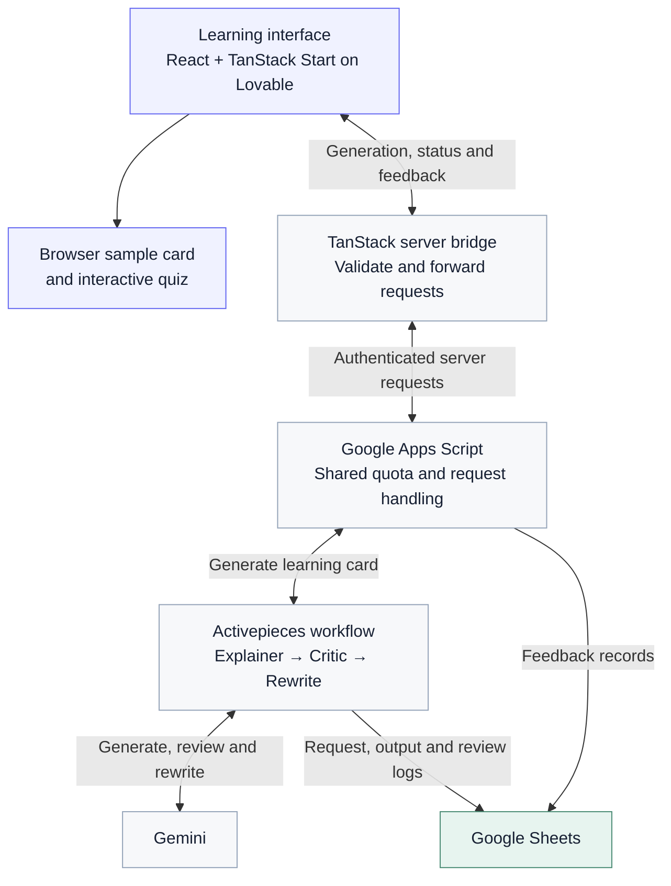

# Analogy Arcade

**Pick a topic. Pick a world. Make it click.**

**[Open Analogy Arcade](https://analogy-arcade-by-khiz.lovable.app)**

Analogy Arcade helps people understand unfamiliar ideas through familiar interests: football, space, Bollywood, building blocks, vacations, superhero-style teams, arcade games, cooking, or any world they choose.

This public repository is a documentation-only product showcase. Application source and deployment configuration are maintained separately in a private repository connected to Lovable.

## The experience

1. Enter a topic you want to understand.
2. Choose an interest or type your own.
3. Pick an audience and the learning-card sections you want.
4. Read a concise explanation, analogy, mapping table, and the analogy’s limits.
5. Test your understanding with a small interactive quiz and share feedback.

A quota-free sample card makes the experience explorable before using the AI service. The refreshed interface uses the open-source Plus Jakarta Sans typeface.

## Architecture

The sample card and quiz interactions run in the browser without model calls. Generated explanations pass through the server bridge; Apps Script enforces the shared allowance and saves feedback. The retained Activepieces workflow is documented as coordinating the three AI stages and writing request, output, and review logs to Google Sheets.

## Product thinking

- [Product brief](docs/PRODUCT.md)
- [Architecture overview](docs/ARCHITECTURE.md)
- [Quality and responsible design](docs/QUALITY.md)
- [Sample learning card](docs/SAMPLE.md)

## Status

The app is published on Lovable. [Try Analogy Arcade](https://analogy-arcade-by-khiz.lovable.app) to explore topics through familiar interests.

The project explores a simple question: can a familiar world make an unfamiliar idea easier to understand, remember, and use?
